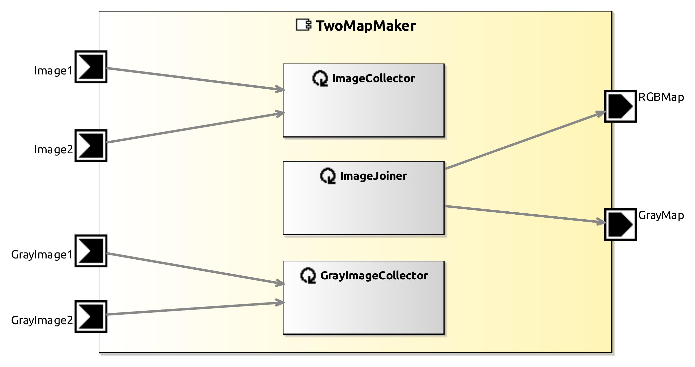

<!--- This file is generated from the TwoMapMaker.componentDocumentation model --->
<!--- do not modify this file manually as it will by automatically overwritten by the code generator, modify the model instead and re-generate this file --->

# TwoMapMaker Component

*Component Short Description:* Map Maker software component

## Component-Datasheet Properties

<table style="border-collapse:collapse;">
<caption><i>Table:</i> Component-Datasheet Properties</caption>
<tr style="background-color:#ccc;">
<th style="border:1px solid black; padding: 5px;"><i>Property Name</i></th>
<th style="border:1px solid black; padding: 5px;"><i>Property Value</i></th>
<th style="border:1px solid black; padding: 5px;"><i>Property Description</i></th>
</tr>
<tr>
<td style="border:1px solid black; padding: 5px;">Supplier</td>
<td style="border:1px solid black; padding: 5px;">Servicerobotics Ulm, Germany</td>
<td style="border:1px solid black; padding: 5px;"></td>
</tr>
<tr>
<td style="border:1px solid black; padding: 5px;">Homepage</td>
<td style="border:1px solid black; padding: 5px;">http://www.servicerobotik-ulm.de</td>
<td style="border:1px solid black; padding: 5px;"></td>
</tr>
<tr>
<td style="border:1px solid black; padding: 5px;">Purpose</td>
<td style="border:1px solid black; padding: 5px;">Component used in binary dependency transmission case study</td>
<td style="border:1px solid black; padding: 5px;"></td>
</tr>
</table>

## Component Ports

### RGBMap

*Documentation:*

### GrayMap

*Documentation:*

### Image1

*Documentation:*

### Image2

*Documentation:*

### GrayImage1

*Documentation:*

### GrayImage2

*Documentation:*

